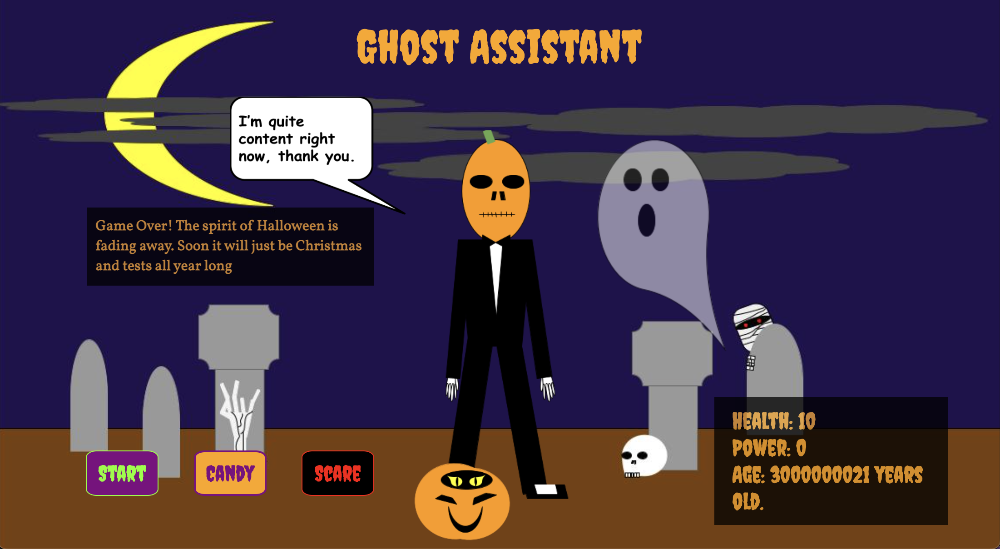
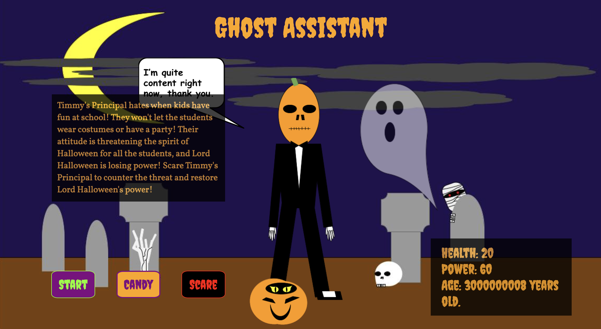
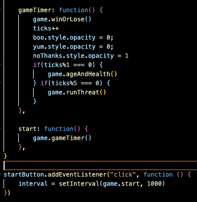
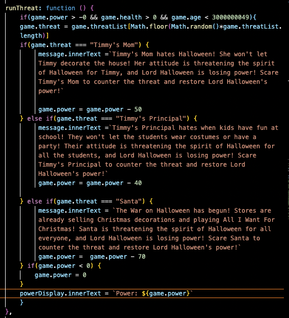
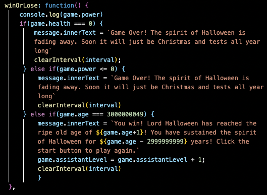

# Ghost Assistant

  ## Project Description

  You are a novice ghost assistant to Lord Halloween, the ruler of Spooky Land. You must keep him healthy and keep his magic spooky power up. His power is what maintains the Spirit of Halloween and keeps Spooky Land happy. 

  Lord Halloween's health declines with age. Click the CANDY button to feed him candy and restore his health. The greater danger is that threats to the Spirit of Halloween will deplete Lord Halloween's spooky power. Click the SCARE button to counter those threats and restore his power. 

  This game is a variation of Tamagotchi, a handheld digital pet game created by Akihiro Yokoi and Aki Maita.

  ## User Stories

  -User will see a description of the game on page load.
  -User will click start to play.
  -User must monitor the health and power displays.
  -User will an see on screen message when a threat occurs.
  -User will click the CANDY and SCARE buttons to replenish Lord Halloween's health and power.
  -Users will see an updated message when they have defeated the threat.
  -Users will be told if they win or lose in an onscreen message.
    
  ## Game Images

  ### Wireframe

  

  ### End Product
  
  Start Screen

  

  Game Over Message
  
  
  
  Threat Message
  
  

  ### Code Samples
  
  Game Start Code
  
  

  Threat Function
  
  
  
  Win or Loss Conditions Function
  
  

  ## Technologies Used:

  I used HTML to create the various divs for different sections of the game screen, as well as adding in the game images.

  I used CSS to style the game buttons, size the images, style the fonts and create text backgrounds. I used CSS grid to create the game screen layout and CSS flex to place items within grid cells. 

  I used JavaScript the the game functionality. All the game variables and functions are contained in one game object. The game functions increased and decreased the value of the health and power, updated displays through DOM manipulation, randomized the selection of threats, and check for win conditions at each interval and stop the game when those conditions are met. Except for the three functions that the player controls through the buttons, the rest of the game runs on an interval timer. 

  The game background and characters are my own original creations, made with Google Drawings. 

  ## Next Steps:

  I have number of ideas for how to build upon this game. One is to make the game appearance more media-responsive. Another styling approach is to add animations. I included some pseudo-animation with the appearance of the talk bubbles. I would like to add more, such as making the pumpkin move sporadically, showing the threats appear on screen, and changing Lord Halloween's position and stance. 

  My main vision for building upon this game, however, is to create a system for the Ghost Assistant to level up. This would make the game more challenging by adding in more variables to track and adding more threats, as well as providing the player with more options to combat those threats. The Ghost would also receive accessories to signify the change, which is a rewarding experience for players.